# ChartX

High-performance GPU-accelerated charting library for Java Swing applications.

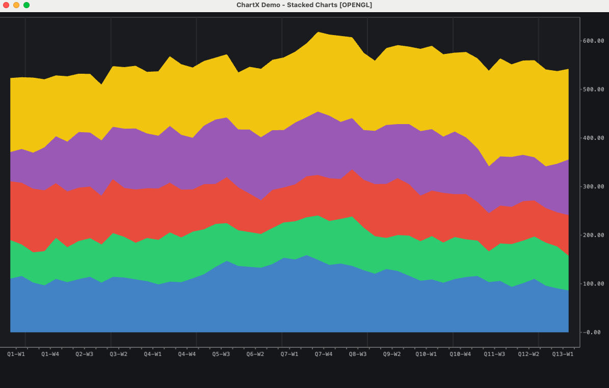

## Features

- **GPU-Accelerated Rendering** - OpenGL 3.3+ for smooth 60 FPS rendering
- **High Performance** - Handles 100,000+ data points with ease
- **30+ Chart Types** - From basic line charts to advanced visualizations
- **Interactive** - Pan, zoom, crosshair, tooltips out of the box
- **Swing Integration** - Drop-in JPanel component
- **HiDPI Support** - Retina and high-DPI display ready
- **Multiple Backends** - OpenGL, Vulkan, Metal (macOS), DirectX 12 (Windows)

## Performance

ChartX significantly outperforms traditional Java charting libraries by leveraging GPU acceleration.

### Benchmark: ChartX vs JFreeChart

*Configuration: 1280x720, 4 OHLC series, 100 measurement iterations*

| Data Size | JFreeChart | ChartX OpenGL | Speedup |
|-----------|------------|---------------|---------|
| 10,000 bars | 10.11ms | 5.54ms | **1.8x faster** |
| 50,000 bars | 37.08ms | 6.45ms | **5.7x faster** |
| 100,000 bars | 69.65ms | 7.91ms | **8.8x faster** |

### Throughput at 100K Data Points

| Library | Frame Time | Throughput |
|---------|-----------|------------|
| JFreeChart | 69.65ms (14 FPS) | 1.4M bars/s |
| ChartX OpenGL | 7.91ms (126 FPS) | 50.6M pts/s |

ChartX maintains smooth 60+ FPS even with 100,000 data points, while JFreeChart drops to ~14 FPS.

## Chart Types

### Line & Area Charts
Line, spline, area, stacked area, step line, mountain charts

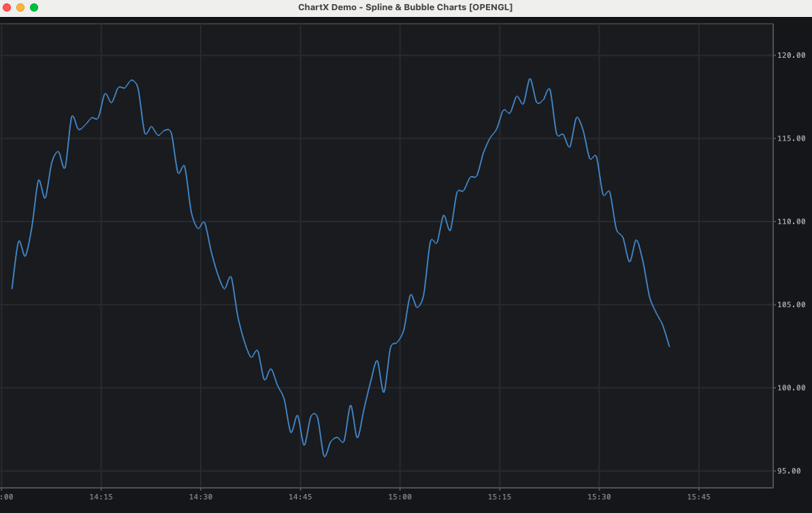

### Bar & Column Charts
Vertical bars, horizontal bars, grouped, stacked, waterfall

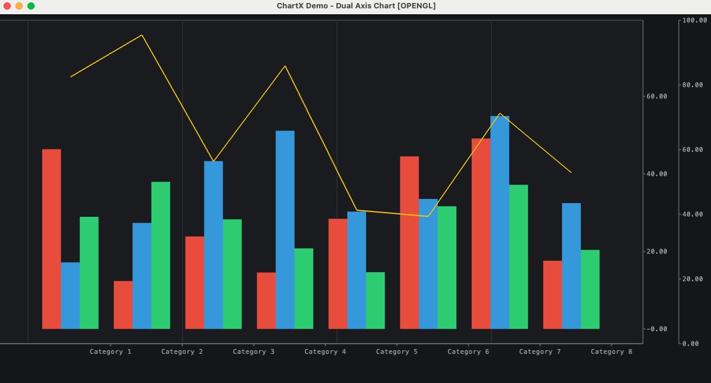

### Statistical Charts
Histogram, box plot, error bars, candlestick, OHLC

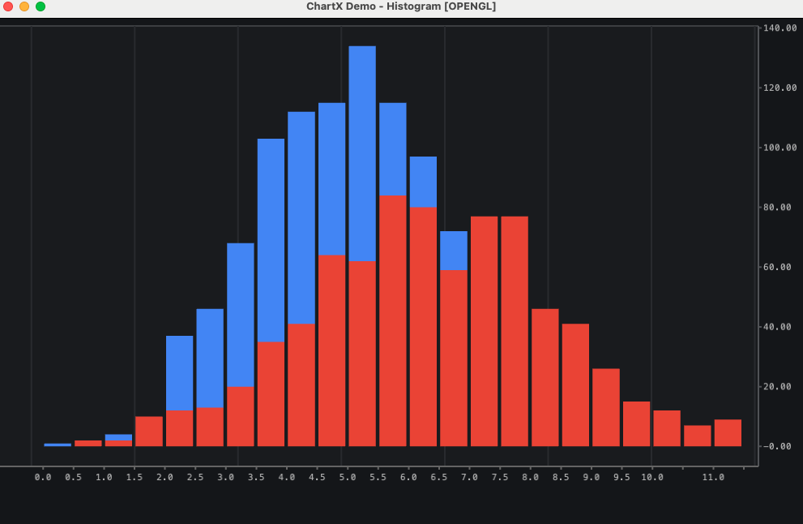


### Scatter & Bubble Charts
Scatter plot with multiple series, bubble charts

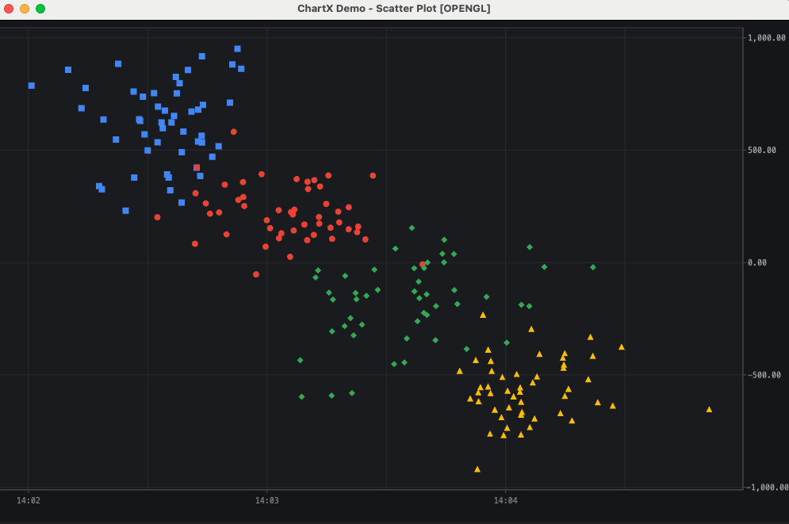

### Pie & Donut Charts
Pie, donut, with labels and legends

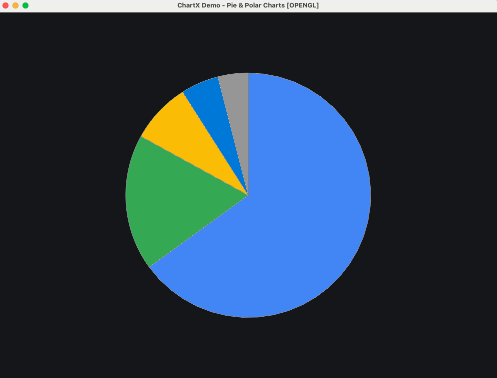

### Heatmap & Contour
Heatmap, contour lines, color gradients

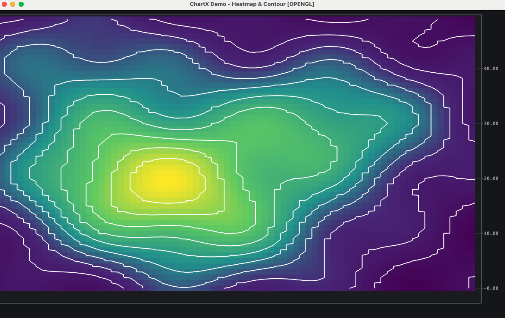

### Specialized Charts
Treemap, gauge, population pyramid, waterfall

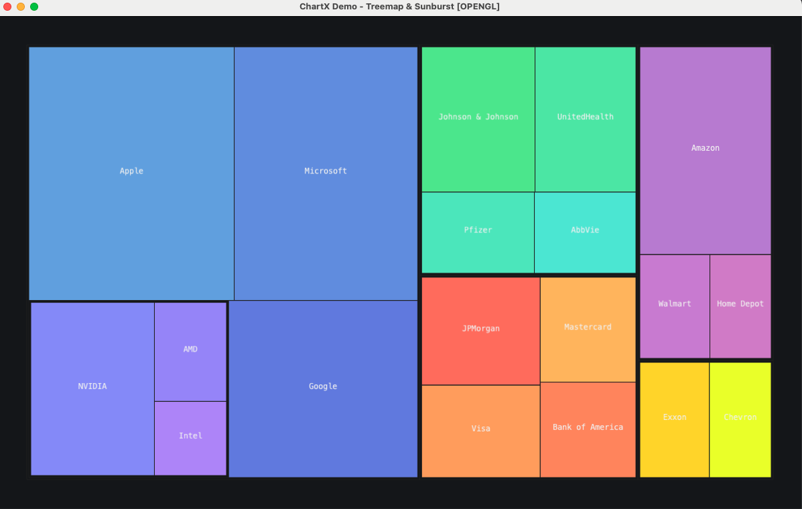
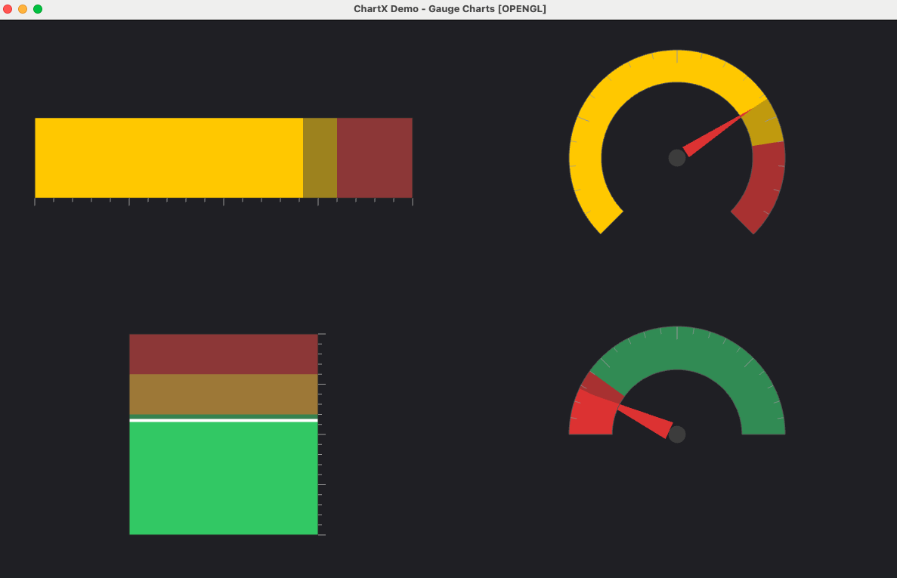
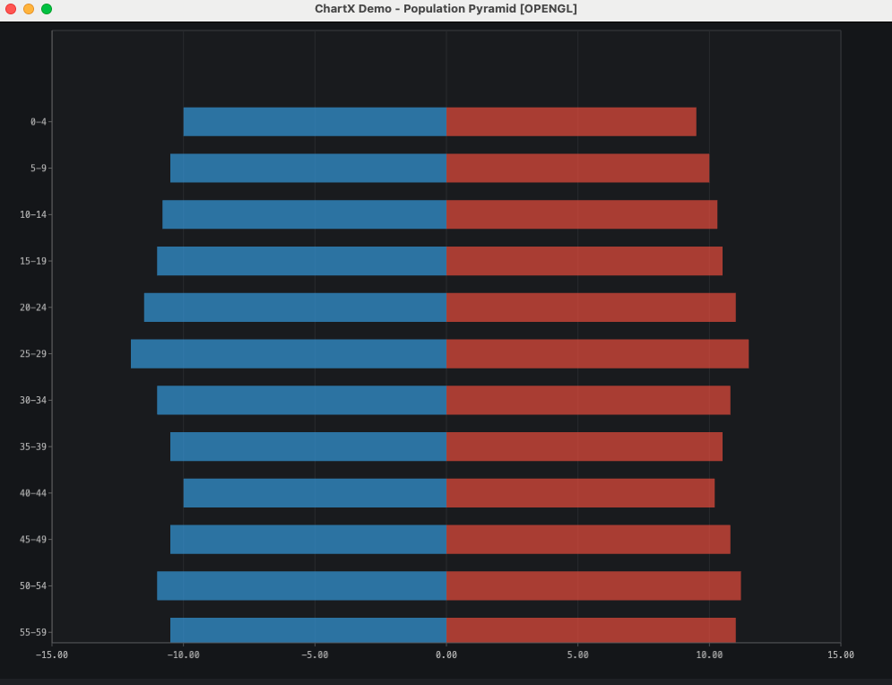

### Financial Charts
Candlestick, OHLC, Market Profile (TPO), technical indicators

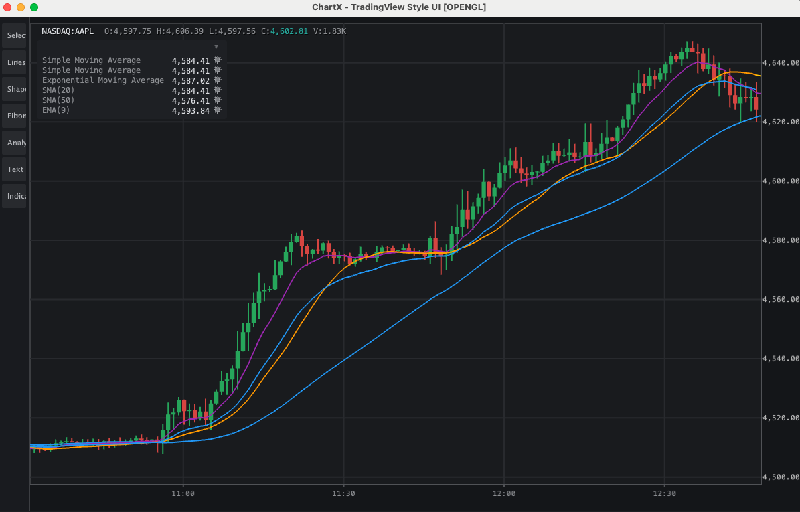
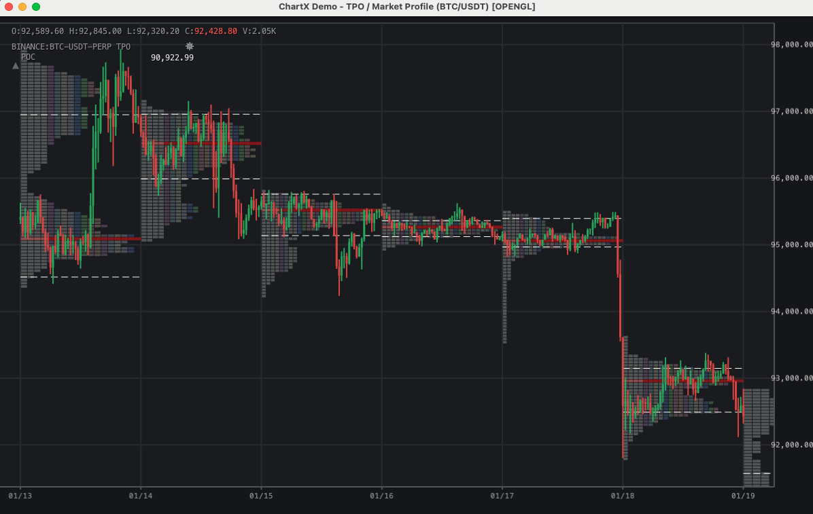

### Multi-Pane Layouts
Synchronized charts, split views, dashboard layouts

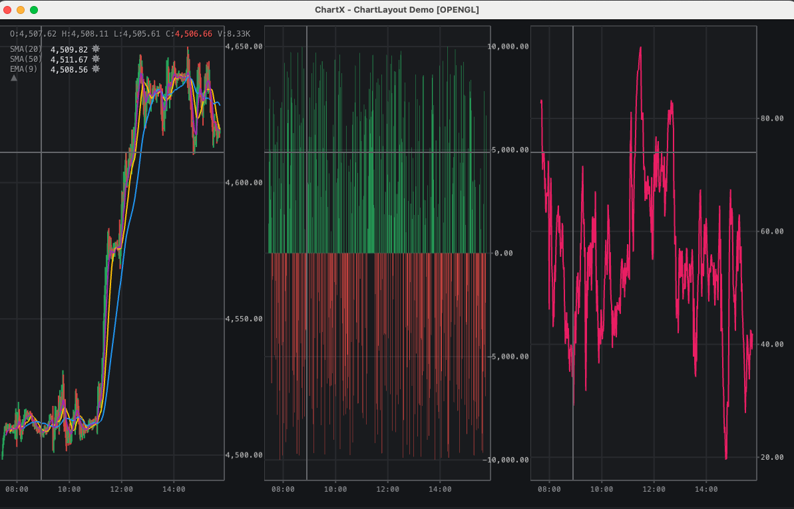

## Installation

Choose one of the following installation methods:

### Option A: Direct JAR Download (Recommended)

Download the JAR from [GitHub Releases](https://github.com/apokalypsix/chartx/releases) and install to your local Maven repository:

```bash
mvn install:install-file -Dfile=chartx-0.1.0.jar \
    -DgroupId=com.apokalypsix -DartifactId=chartx \
    -Dversion=0.1.0 -Dpackaging=jar
```

Then add ChartX and its required dependencies to your project:

#### Maven

```xml
<!-- ChartX -->
<dependency>
    <groupId>com.apokalypsix</groupId>
    <artifactId>chartx</artifactId>
    <version>0.1.0</version>
</dependency>

<!-- Required: JOGL (OpenGL bindings) -->
<dependency>
    <groupId>org.jogamp.gluegen</groupId>
    <artifactId>gluegen-rt-main</artifactId>
    <version>2.5.0</version>
</dependency>
<dependency>
    <groupId>org.jogamp.jogl</groupId>
    <artifactId>jogl-all-main</artifactId>
    <version>2.5.0</version>
</dependency>

<!-- Required: Eclipse Collections -->
<dependency>
    <groupId>org.eclipse.collections</groupId>
    <artifactId>eclipse-collections</artifactId>
    <version>11.1.0</version>
</dependency>

<!-- Required: FlatLaf (UI components) -->
<dependency>
    <groupId>com.formdev</groupId>
    <artifactId>flatlaf</artifactId>
    <version>3.4</version>
</dependency>

<!-- Required: SLF4J logging -->
<dependency>
    <groupId>org.slf4j</groupId>
    <artifactId>slf4j-api</artifactId>
    <version>2.0.9</version>
</dependency>
```

Add the JOGL repository to resolve native libraries:

```xml
<repositories>
    <repository>
        <id>jogamp</id>
        <url>https://jogamp.org/deployment/maven</url>
    </repository>
</repositories>
```

#### Gradle

```groovy
repositories {
    mavenCentral()
    maven { url 'https://jogamp.org/deployment/maven' }
}

dependencies {
    implementation 'com.apokalypsix:chartx:0.1.0'
    implementation 'org.jogamp.gluegen:gluegen-rt-main:2.5.0'
    implementation 'org.jogamp.jogl:jogl-all-main:2.5.0'
    implementation 'org.eclipse.collections:eclipse-collections:11.1.0'
    implementation 'com.formdev:flatlaf:3.4'
    implementation 'org.slf4j:slf4j-api:2.0.9'
}
```

### Option B: GitHub Packages

GitHub Packages requires authentication even for public packages.

**1. Create a GitHub token:** GitHub → Settings → Developer settings → Personal access tokens → Generate new token (select `read:packages`)

**2. Add to `~/.m2/settings.xml`:**

```xml
<settings>
  <servers>
    <server>
      <id>github</id>
      <username>YOUR_GITHUB_USERNAME</username>
      <password>YOUR_GITHUB_TOKEN</password>
    </server>
  </servers>
</settings>
```

**3. Add repository and dependency:**

#### Maven

```xml
<repositories>
    <repository>
        <id>github</id>
        <url>https://maven.pkg.github.com/apokalypsix/chartx</url>
    </repository>
</repositories>

<dependency>
    <groupId>com.apokalypsix</groupId>
    <artifactId>chartx</artifactId>
    <version>0.1.0</version>
</dependency>
```

#### Gradle

```groovy
repositories {
    maven {
        url = uri("https://maven.pkg.github.com/apokalypsix/chartx")
        credentials {
            username = project.findProperty("gpr.user") ?: System.getenv("GITHUB_USERNAME")
            password = project.findProperty("gpr.token") ?: System.getenv("GITHUB_TOKEN")
        }
    }
}

dependencies {
    implementation 'com.apokalypsix:chartx:0.1.0'
}
```

## Quick Start

### Basic Line Chart

```java
import com.apokalypsix.chartx.chart.Chart;
import com.apokalypsix.chartx.chart.data.XyData;
import com.apokalypsix.chartx.core.render.api.RenderBackend;

// Create chart
Chart chart = new Chart(RenderBackend.OPENGL);

// Create data
XyData data = new XyData();
for (int i = 0; i < 100; i++) {
    data.append(System.currentTimeMillis() + i * 60000, Math.sin(i * 0.1) * 100);
}

// Add line series
chart.addLineSeries(data);

// Add to Swing frame
frame.add(chart);
```

### Bar Chart with Categories

```java
import com.apokalypsix.chartx.chart.Chart;
import com.apokalypsix.chartx.chart.axis.CategoryAxis;

Chart chart = new Chart(RenderBackend.OPENGL);

// Set up category axis
CategoryAxis xAxis = new CategoryAxis();
xAxis.setCategories("Q1", "Q2", "Q3", "Q4");
chart.setXAxis(xAxis);

// Add bar series
chart.addColumnSeries(data, new ColumnSeriesOptions()
    .color(Color.BLUE));
```

### Candlestick Chart

```java
import com.apokalypsix.chartx.chart.finance.FinanceChart;
import com.apokalypsix.chartx.chart.data.OhlcData;

FinanceChart chart = new FinanceChart(RenderBackend.OPENGL);

OhlcData data = new OhlcData();
data.append(timestamp, open, high, low, close, volume);
// ... add more data

chart.addCandlestickSeries(data);
```

## Running Examples

### Prerequisites

- Java 17+
- Maven 3.8+
- OpenGL 3.3+ capable GPU

### Clone and Run

```bash
git clone https://github.com/apokalypsix/chartx.git
cd chartx
mvn compile

# Run demos
mvn exec:java -Pdemo              # Basic chart demo
mvn exec:java -Pdemo-indicators   # Technical indicators
mvn exec:java -Pdemo-tpo          # Market Profile
mvn exec:java -Pdemo-all-series   # All series types
mvn exec:java -Pdemo-ohlc         # OHLC candlestick
```

### Run Any Demo

```bash
mvn exec:java -Dexec.mainClass="com.apokalypsix.chartx.examples.chart.HistogramDemo"
mvn exec:java -Dexec.mainClass="com.apokalypsix.chartx.examples.chart.ScatterPlotDemo"
mvn exec:java -Dexec.mainClass="com.apokalypsix.chartx.examples.chart.HeatmapContourDemo"
```

### Run Benchmarks

```bash
mvn exec:java -Pbenchmark           # Full benchmark suite
mvn exec:java -Pbenchmark-simple    # Simple benchmark
mvn exec:java -Pbenchmark-jfreechart # Compare with JFreeChart
```

## All Examples

| Demo | Description |
|------|-------------|
| `AllSeriesTypesDemo` | Overview of all series types |
| `ChartDemo` | Basic line/candlestick chart |
| `ChartLayoutDemo` | Multi-pane synchronized layouts |
| `ColumnBarDemo` | Column and bar charts |
| `DifferenceChartDemo` | Difference/comparison charts |
| `DualAxisDemo` | Dual Y-axis with bars and line |
| `GaugeDemo` | Gauge and meter charts |
| `HeatmapContourDemo` | Heatmap with contour lines |
| `HistogramDemo` | Histogram distribution |
| `IndicatorsDemo` | Technical indicators (SMA, EMA, RSI) |
| `LogScaleDemo` | Logarithmic axis scaling |
| `ModifierDemo` | Interactive modifiers |
| `MultiSeriesDemo` | Multiple overlaid series |
| `MultiTimeframeDemo` | Multi-timeframe analysis |
| `PiePolarDemo` | Pie and donut charts |
| `PopulationPyramidDemo` | Population pyramid |
| `ProjectedValuesDemo` | Forecasts with confidence bands |
| `ScatterPlotDemo` | Scatter plot with clusters |
| `SeriesOptionsDemo` | Series styling options |
| `SplineChartsDemo` | Smooth spline curves |
| `StackedChartsDemo` | Stacked area charts |
| `StatisticalDemo` | Box plots and error bars |
| `TPODemo` | Market Profile (TPO) |
| `TreemapSunburstDemo` | Treemap visualization |

## Requirements

- Java 17+
- OpenGL 3.3+ capable GPU
- Windows, macOS, or Linux

## License

ChartX is released under the [Polyform Noncommercial License 1.0.0](https://polyformproject.org/licenses/noncommercial/1.0.0).

**Free for:**
- Personal use
- Research and education
- Non-commercial projects
- Open source projects

**Commercial use** requires a license. Contact: licensing@apokalypsix.com

See [LICENSE](LICENSE) for full terms.
